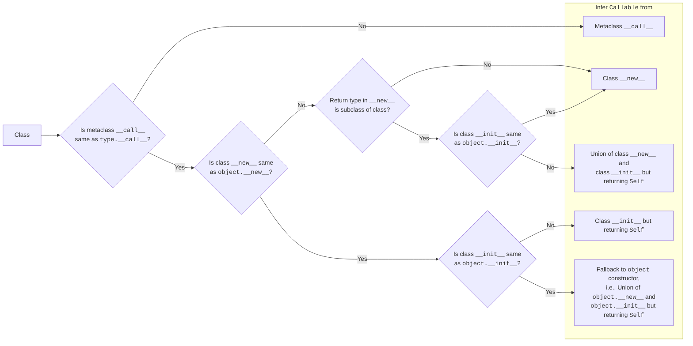

# Notes

## HKTs for Python

- Python currently doesn't have an abstraction to represent type constructors or rather the type of type constructors (a.k.a. kind).
- The goal here currently is to enable the type system to infer and recognise kinds.
- We should introduce a system to define a type variable / kind variable to denote something that varies over a type constructor.
  Similar to `TypeVar` which represents type variables, we can introduce a `KindVar`, and a more verbose name would be `TypeConstructorVar`. We shall stick to `KindVar` for the time being.
- We can also consider adding it to the existing `TypeVar` system with some additional kwargs, instead of a separate `KindVar`.
  This is not done right now while specifying the draft to keep them possibly separate and avoid premature coupling, and to not interfere with the existing `TypeVar` inference for the proof-of-concept, and also since backward compatibility or backport concerns are not exactly a top priority right now (this should be a top priority to be considered later when we have cleared the kind inference issues about how a higher kinded system behaves in a language like Python).
  At a later stage, we would be able to assess clearly whether a new `KindVar` system is actually needed or we can safely make it work with the existing `TypeVar` system with additions.

## [PEP 673 – Self Type](https://peps.python.org/pep-0673/)

[`Self`](https://typing.python.org/en/latest/spec/generics.html#self) was added in [PEP 673](https://peps.python.org/pep-0673/) to denote an (implicit) type variable bound to the current class.
When used in a [method signature](https://peps.python.org/pep-0673/#use-in-method-signatures) or in [parameters](https://peps.python.org/pep-0673/#use-in-parameter-types), it is an implicit way to denote a type variable referring to an instance of the current class, and when used in a [classmethod signature](https://peps.python.org/pep-0673/#use-in-classmethod-signatures), it acts as an implicit way to annotate `cls: type[Self]`.
When used in [generic class methods](https://peps.python.org/pep-0673/#use-in-generic-classes), it preserves the type arguments of the object on which the generic method was called on.

```python
from typing import Any, Self


# Uses `typing.Self`:
class UsesImplicitTypingSelf:
    # `self` is automatically inferred as `Self`.
    def identity1(self) -> Self:
        return self

    # Or we can be explicit with annotating `self`.
    def identity2(self: Self) -> Self:
        return self

    # `cls` is automatically inferred as `type[Self]`.
    @classmethod
    def new1(cls) -> Self:
        return cls()

    # Or we can be explicit with annotating `cls`.
    @classmethod
    def new2(cls: type[Self]) -> Self:
        return cls()


# This is how `typing.Self` translates to:
class UsesExplicitSelf:
    # What this means is that `Self` is actually implicitly bound like this.
    # Note that we need to be explicit with annotating `self` here.
    def identity[Self: UsesExplicitSelf](self: Self) -> Self:
        return self

    # What this means is that `Self` is actually implicitly bound like this.
    # Note that we need to be explicit with annotating `cls` here.
    @classmethod
    def new[Self: UsesExplicitSelf](cls: type[Self]) -> Self:
        return cls()


# This is how `typing.Self` translates to, in Generic classes:
class UsesExplicitSelfAndIsGeneric[T]:
    # What this means is that `Self` is actually implicitly bound like this.
    # The TypeVar bound uses `Any`, and the type arguments of the
    # specific type of the instance calling this method is preserved.
    # Note that we need to be explicit with annotating `self` here, again
    def identity[Self: UsesExplicitSelfAndIsGeneric[Any]](self: Self) -> Self:
        return self

    # What this means is that `Self` is actually implicitly bound like this.
    # The TypeVar bound uses `Any`, and the type arguments of the
    # specific type of the instance calling this method is preserved.
    # Note that we need to be explicit with annotating `cls` here, again.
    @classmethod
    def new[Self: UsesExplicitSelfAndIsGeneric[Any]](cls: type[Self]) -> Self:
        return cls()
```

The current `typing.Self` is just a shorthand for convenience to denote such implicit-current-class-bound TypeVars.

(There is also some nuance with the scope of the type variables here.
With post PEP 695 syntax, we can see the differences:

- In `UsesImplicitTypingSelf` class:
  `(method) def identity1(self: Self@UsesImplicitTypingSelf) -> Self@UsesImplicitTypingSelf`

- In `UsesExplicitSelf` class:
  `(method) def identity(self: Self@identity) -> Self@identity`
  )

## [Constructor to Callable](https://typing.python.org/en/latest/spec/constructors.html#converting-a-constructor-to-callable)

_Rough pseudocode:_

```plaintext
If metaclass overrides type.__call__:
    If return type of __call__ is not a subclass (or union including a subclass):
        => Synthesize from __call__ only
        Ignore __new__ and __init__ here
If class overrides object.__new__:
    If return type of __new__ is not a subclass (or union including a subclass):
        => Synthesize from __new__ only
        Ignore __init__ here
    ElseIf class overrides object.__init__:
        => Synthesize from union of __new__ and __init__ (parameters only while returning Self)
    Else:
        => Synthesize from __new__
ElseIf class overrides object.__init__:
    => Synthesize from __init__ (parameters only while returning Self)
Else:
    => Fallback to object constructor, i.e.,
    Synthesize from union of object.__new__ and object.__init__ (parameters only while returning Self)
```

---

_Infer `Callable` from class constructor (roughly):_

FIXME: <small> There is more happening when metaclass `__call__` overrides `type.__call__` but doesn't hamper return type, then there are a few branches missing below.</small>



## `type(...)` type inference

There are some problems with type inference when using `type(...)`.

```python
from typing import reveal_type

reveal_type([1, 2, 3])
# Runtime: Runtime type is 'list'
# mypy: Revealed type is "builtins.list[builtins.int]"
# pyright: Type of "[1, 2, 3]" is "list[int]"

print(type([1, 2, 3]))
# <class 'list'>

reveal_type(type([1, 2, 3]))
# Runtime: Runtime type is 'type'
# mypy: Revealed type is "type[builtins.list[builtins.int]]"
# pyright: Type of "type([1, 2, 3])" is "type[list[int]]"
```

The runtime sees `[1, 2, 3]` as an instance of class `list`, and typecheckers see it as being of type `list[int]`.
`type(obj)` returns the object's type, so `type([1, 2, 3])` is `<class 'list'>` at runtime, and typecheckers see this as being of type `type[list[int]]`.
Even though at runtime we have `type([1, 2, 3])` as `<class 'list'>`, we're not able to specialise it to, say a `list[str]` at the type level.
The type system currently doesn't have a way to express this behaviour (ignoring `typing.cast`).

Typechecker's understanding of `type[list[int]]` is that when this type is instantiated, we get an object of type `list[int]`.

Related:

- https://typing.python.org/en/latest/spec/special-types.html#type
- https://discuss.python.org/t/clarifications-to-the-typing-spec-regarding-type/54596
- https://discuss.python.org/t/specs-clarification-type-a-b-is-equivalent-the-same-as-type-a-type-b/60912
- https://discuss.python.org/t/enforcing-init-signature-when-implementing-it-as-an-abstractmethod/75690
- https://discuss.python.org/t/idea-decorator-for-functions-that-should-be-usable-as-types/74199

---

Currently we have it in [typeshed](https://github.com/python/typeshed/blob/8bf790086aa26c1b2d45185511af7949ee0ef8c8/stdlib/builtins.pyi#L186) as

```python
import _typeshed


@disjoint_base
class type:
    @overload
    def __init__(self, o: object, /) -> None: ...
    @overload
    def __init__(
        self, name: str, bases: tuple[type, ...], dict: dict[str, Any], /, **kwds: Any
    ) -> None: ...
    @overload
    def __new__(cls, o: object, /) -> type: ...
    @overload
    def __new__(
        cls: type[_typeshed.Self],
        name: str,
        bases: tuple[type, ...],
        namespace: dict[str, Any],
        /,
        **kwds: Any,
    ) -> _typeshed.Self: ...
```

Related:

- https://discuss.python.org/t/removing-type-checker-internals-from-typeshed/87960

## Existing work on HKTs for Python

### [nekitdev](https://github.com/nekitdev/peps/blob/main/peps/pep-9999.rst)'s PEP draft

This proposal [recognises](https://github.com/python/typing/issues/548#issuecomment-1347406592) the `type(...)` problem.

There are a few problems with this proposal.
(Note: Some of these problems also exist for our proposal, and we need to address them yet).

1.  As also pointed out [here](https://github.com/python/typing/issues/548#issuecomment-1347557116), there are some issues as to what to do when subclasses take in more arguments when creating a new instance.

    This is related to a more general problem of dealing with [constructor calls for `type[T]`](https://typing.python.org/en/latest/spec/constructors.html#constructor-calls-for-type-t).

2.  Subscriptable `Self`.

    The proposal for HKTs in the draft PEP here is incomplete and only talks about the usage syntax, and doesn't specify the implementation of subscriptable `Self`, which is the core problem that we're addressing in the first place since the current type system doesn't understand kinds yet.

    This syntax could possibly work, but we have to change the meaning of this implicit `Self` to denote a type constructor instead when subscripting, which is what we're trying to build with `KindVar`.
    There maybe some possible backward compatibility issues here, and we have to look into this more thoroughly.

    For Generic classes, an unsubscripted `Self` could continue being treated as a bounded `TypeVar` with all typeargs with `Any`, while a parametrised `Self` should translate to a `KindVar`, and all typeargs should be explicitly specified when using like so.
    For Non-Generic classes, subscriptable `Self` makes no sense, so a type checker should reject it.
    Hopefully, this above specification shouldn't present any backward compatibility issues.

    TODO:
    Think about subscriptable `Self` in a nested Generic context.

    Related:
    - https://github.com/python/typing/discussions/1555#discussioncomment-7981513

### [returns](https://returns.readthedocs.io/en/latest/pages/hkt.html) library (HKT emulation)

Adds `KindN` and `Container` typing constructs along with a mypy plugin.

TODO: Expand more on this approach.

## Other languages

### Haskell

### Scala

See [scala.md](scala.md)

### Roc

- https://github.com/roc-lang/roc/blob/4e51efcba5a9e97063a67a855d5dbb6adaeba116/www/content/faq.md#why-doesnt-roc-have-higher-kinded-polymorphism-or-arbitrary-rank-types

## Misc

- Rough ideas:
  - A `KindError` similar to `TypeError`.

- See [PEP 827](https://peps.python.org/pep-0827/), particularly the `typing.GetArg[T, Base, I]` that is being proposed.

- Annotating `self` argument in `__init__`

  https://github.com/python/typing/issues/1563

- https://discuss.python.org/t/generic-type-inference-from-another-generic-type/84354

- https://discuss.python.org/t/typemap-generalizing-overload-semantics/105440
